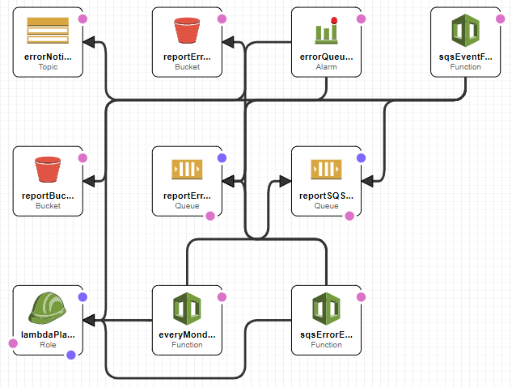

# PlayerReports

## Description
A lambda is set to run every monday. It pulls data from a csv in S3. Formats the data into reports and sends each reports into an SQS queue.
A second lambda is triggered for each Queued Item in the SQS Queue. This lambda reaches out to the PDF API creates the pdf and saves the file to S3.

This has been created with AWS SAM. You will need the SAM-CLI to deploy this code.
To deploy this:
You will need the following cloudformation parameters for the code to run.
- PDFKEY = the pdf api key
- PDFSECRET = the pdf api secret
- PDFWORKSPACE = the pdf workspace identifier
- PDFTEMPLATEID = the pdf template id
- PDFAPIURL = the pdf api endpoint
- ERROREMAIL = the email you want the error notification sent to

You will also need to have and spec a s3 bucket in the same availability zone where you deploy this template.

## Useful Info
This project contains source code and supporting files for a serverless application that you can deploy with the SAM CLI.

The application uses several AWS resources, including Lambda functions and an API Gateway API. These resources are defined in the `template.yaml` file in this project. You can update the template to add AWS resources through the same deployment process that updates your application code.

If you prefer to use an integrated development environment (IDE) to build and test your application, you can use the AWS Toolkit.  
The AWS Toolkit is an open source plug-in for popular IDEs that uses the SAM CLI to build and deploy serverless applications on AWS. The AWS Toolkit also adds a simplified step-through debugging experience for Lambda function code. See the following links to get started.

* [PyCharm](https://docs.aws.amazon.com/toolkit-for-jetbrains/latest/userguide/welcome.html)
* [IntelliJ](https://docs.aws.amazon.com/toolkit-for-jetbrains/latest/userguide/welcome.html)
* [VS Code](https://docs.aws.amazon.com/toolkit-for-vscode/latest/userguide/welcome.html)
* [Visual Studio](https://docs.aws.amazon.com/toolkit-for-visual-studio/latest/user-guide/welcome.html)

The Serverless Application Model Command Line Interface (SAM CLI) is an extension of the AWS CLI that adds functionality for building and testing Lambda applications. It uses Docker to run your functions in an Amazon Linux environment that matches Lambda. It can also emulate your application's build environment and API.

To use the SAM CLI, you need the following tools.

* SAM CLI - [Install the SAM CLI](https://docs.aws.amazon.com/serverless-application-model/latest/developerguide/serverless-sam-cli-install.html)
* Node.js - [Install Node.js 10](https://nodejs.org/en/), including the NPM package management tool.
* Docker - [Install Docker community edition](https://hub.docker.com/search/?type=edition&offering=community)

